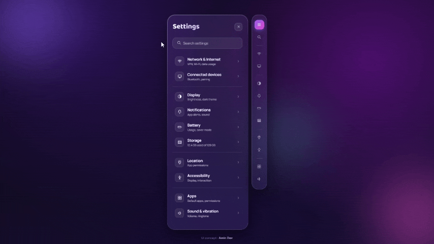

# Glass Settings UI

A single-file recreation of a mobile settings screen, built to explore glassmorphism — frosted panels, layered blur, and soft ambient light — done entirely in vanilla HTML/CSS/JS with no frameworks or build step.

## Preview



## Features

- Frosted-glass panels using `backdrop-filter: blur()` with layered gradient borders
- Animated ambient "aurora" blobs drifting behind the UI for depth
- Two synced views: a full settings list and a collapsed icon rail
- Hover states with gradient icon fills and directional micro-animations
- Fully responsive at small viewport widths

## Tech

- Plain HTML, CSS, and JavaScript — no dependencies, no build tooling
- Google Fonts (Baloo 2 for display text, Manrope for body)
- SVG icons generated inline via a small JS helper, rather than an icon library

## Why

Built as a UI/design exercise — practicing layout, motion, and visual hierarchy without leaning on a component library. The goal was to see how far pure CSS could go in recreating a native-feeling settings experience.

## Run it

No build step needed — just open `index.html` in a browser, or serve the folder:

```bash
npx serve .
```

## License

MIT — do whatever you want with it.
